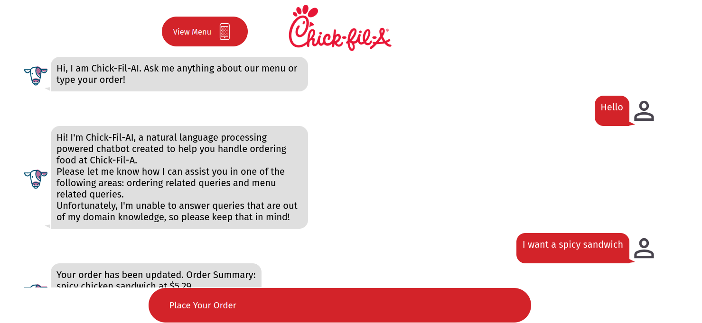

# Chick-fil-AI Chatbot



This project is an AI chatbot application for Chick-fil-A restaurants, developed as a senior design project (CS 4485) for Computer Science majors at The University of Texas at Dallas.
The following members contributed to this project:

1. [Aditya Kulkarni](https://www.linkedin.com/in/aditya34/)
2. [Agastya Bose](https://www.linkedin.com/in/agastya-bose/)
3. [David Tepeneu](https://www.linkedin.com/in/david-tepeneu/)
4. [Dilon Sok](https://www.linkedin.com/in/dilon-sok/)
5. [Grace Zhou](https://www.linkedin.com/in/gzhou624/)

## Project Structure

The project is organized into two main subdirectories:

- `backend`: Contains the Flask API, NLP scripts, and database scripts
- `frontend`: Contains the React application

Both subdirectories have their own Dockerfiles for containerization.

## Prerequisites

Before running the application, ensure you have the following:

1. Docker and Docker Compose installed on your system
2. Required API keys and secrets:
   - Google Dialogflow credentials
   - MongoDB URI

## Getting Started

To run the application:

1. Clone this repository
2. Navigate to the project's root directory
3. Set up the required environment variables (see "Environment Variables" section below)
4. Run the following command:

```bash
docker compose up --build
```

This command will build and start both the backend and frontend containers.

## Environment Variables

Create a `.env` file in the project root directory with the following variables:

```
URI-MONGODB="your MongoDB URI"
GOOGLE_APPLICATION_CREDENTIALS="path to your Dialogflow credentials json file"
SESSION_ID="your randomly generated session ID"
```

Replace the placeholder values with your actual API keys and secrets.

## Backend

The backend is built using Flask and serves as the API for the chatbot. It interacts with:

- Google Dialogflow for natural language processing
- MongoDB to store and query the restaurant menu

## Frontend

The frontend is a React application that provides the user interface for interacting with the chatbot.

## Data Storage

The restaurant menu is stored in an Amazon DynamoDB table, which is queried by the backend during the runtime of the application.

## Contributing

This project is part of UTD's senior design course for computer science and software engineering majors. No external contributions will be accepted.
